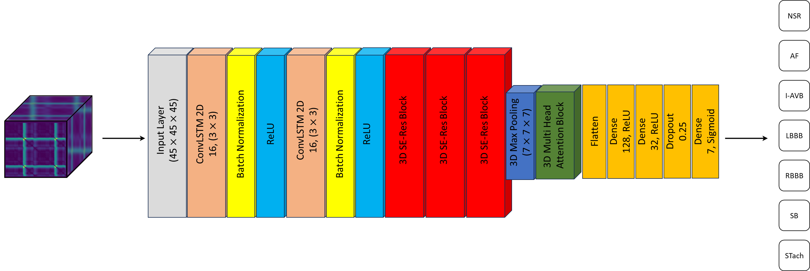

# 3DECG-Net
This repository contains the materials related to the 3DECG-Net study. In this study, we developed an innovative preprocessing framework for processing 12-lead electrocardiogram (ECG) recordings. We also created a novel 3D deep learning model to classify 12-lead ECG signals into seven distinct heart conditions: Normal Sinus Rhythm (NSR), Atrial Fibrillation (AF), First-Degree Atrioventricular Block (I-AVB), Left Bundle Branch Block (LBBB), Right Bundle Branch Block (RBBB), Sinus Bradycardia (SB), and Supraventricular Tachycardia (STach). Additionally, we implemented the LIME technique to reveal each lead's impact on the classification of each arrhythmia.
______________________
The **ECG 3D Converter** exhibits the capability to process 12-lead ECG recordings while ensuring the provision of high-level recordings without compromising the quality of the signals. This feature proves particularly advantageous in practical scenarios where storage hardware is constrained, and there exists an imperative demand for high-quality, lightweight data.

______________________
The **3DECG-Net model** excels in its ability to classify heart statuses in a multi-label fashion, surpassing other state-of-the-art models in the domain. The demonstrated proficiency of 3DECG-Net positions it as a viable candidate for clinical applications, further solidifying its potential utility in the field.

______________________

`preprocess.py` contains the preprocessing steps.

`models.py` contains the architecture of 3DECG-Net and benchmark models.

`3DECG-Net-Fold1.ipynb` is a notebook containing the codes and results of training fold 1 of 3DECG-Net.

`3DECG-Net-Fold2.ipynb` is a notebook containing the codes and results of training fold 2 of 3DECG-Net.

`3DECG-Net-Fold3.ipynb` is a notebook containing the codes and results of training fold 3 of 3DECG-Net.

`3DECG-Net-Fold4.ipynb` is a notebook containing the codes and results of training fold 4 of 3DECG-Net.

`3DECG-Net-Fold5.ipynb` is a notebook containing the codes and results of training fold 5 of 3DECG-Net.

`3DECG-Net.ipynb` is a notebook containing the codes and results of the training of 3DECG-Net on all the training samples.

`zhang-et-al.ipynb` is a notebook containing the codes and results of the training of the model proposed by Zhang et al. on all the training samples (a benchmark model).

`sobahi-et-al.ipynb` is a notebook containing the codes and results of the training of the model proposed by Sobahi et al. on all the training samples (a benchmark model).

`ribeiro-et-al.ipynb` is a notebook containing the codes and results of the training of the model proposed by Ribeiro et al. on all the training samples (a benchmark model).

All the trained models can be accessed via the following link:

[Link](https://drive.google.com/drive/folders/1S7EihnnilsTMQZtOr7bIOwGyYo7p4uQP?usp=drive_link).

