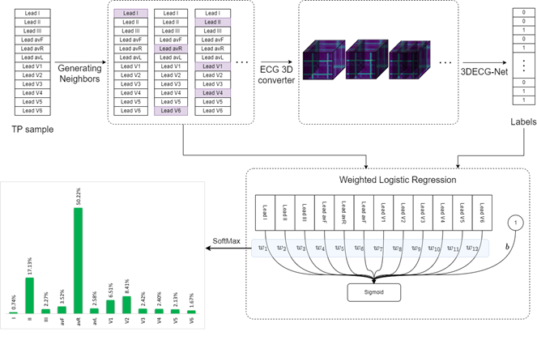

# 3DECG-Net
This repository contains the materials related to the 3DECG-Net study. In this study, we developed an innovative preprocessing framework for processing 12-lead electrocardiogram (ECG) recordings. We also created a novel 3D deep learning model to classify 12-lead ECG signals into seven distinct heart conditions: Normal Sinus Rhythm (NSR), Atrial Fibrillation (AF), First-Degree Atrioventricular Block (I-AVB), Left Bundle Branch Block (LBBB), Right Bundle Branch Block (RBBB), Sinus Bradycardia (SB), and Supraventricular Tachycardia (STach). Additionally, we implemented the LIME technique to reveal each lead's impact on the classification of each arrhythmia.
______________________
The **ECG 3D Converter** exhibits the capability to process 12-lead ECG recordings while ensuring the provision of high-level recordings without compromising the quality of the signals. This feature proves particularly advantageous in practical scenarios where storage hardware is constrained, and there exists an imperative demand for high-quality, lightweight data.

______________________
The **3DECG-Net model** excels in its ability to classify heart statuses in a multi-label fashion, surpassing other state-of-the-art models in the domain. The demonstrated proficiency of 3DECG-Net positions it as a viable candidate for clinical applications, further solidifying its potential utility in the field.

______________________
We also utilized the **Local Interpretable Model-Agnostic Explanations (LIME)** technique to show the importance of each lead in detecting different arrhythmias using 3DECG-Net. The results of this analysis demonstrated that our model processes 12-lead ECG signals in a manner similar to clinicians, making it reliable and trustworthy for practical use as an automatic ECG interpreter in medical centers.

______________________

Folders in this repository contain:

- `3DECG-Net`: The implementation of our proposed model and its different folds.
  
- `Benchmark-Models`: The implementation of the benchmark models.
  
- `Repo_images`: The images used in this repository.
  
- `Utilities`: A series of functions utilized in different notebooks of this project.
  
- `XAI`: The implementation of the LIME technique for each target arrhythmia.

All the trained models can be accessed via the following link:

[Link to the trained models](https://drive.google.com/drive/folders/1S7EihnnilsTMQZtOr7bIOwGyYo7p4uQP?usp=drive_link).

This study is currently under review in the **Computer in Biology and Medicine** journal.

